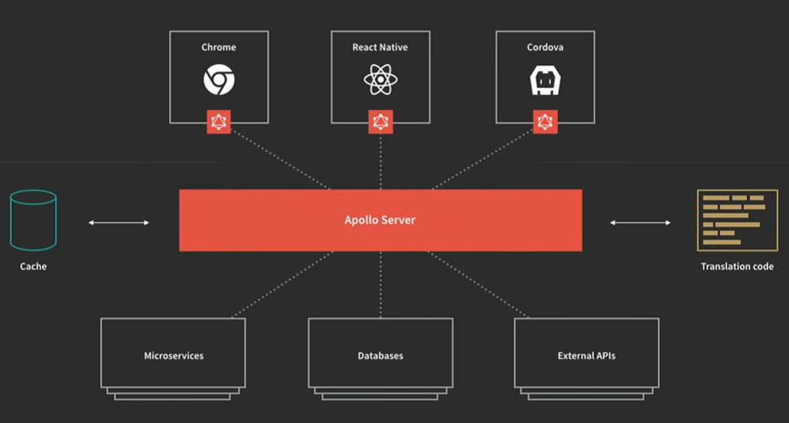
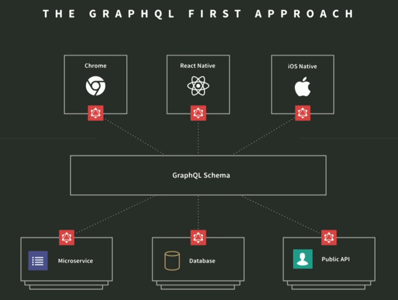

# Apollo
**********************************************
Es un intermediario entre el cliente y los datos. Permite una conexión flexible vía HTTP, es decir no requiere una conexión DDP y se puede consultar otras APIs dentro de la aplicación sin mayor configuración. En cuanto a **Meteor** permite trabajar con otras bases de datos en vez de **MongoDB**.

- **Server:**

  Proceso que se situa entre las fuentes de datos y el código cliente. 
  Se encarga de unificar cualquier número de bases de datos en un único flujo de datos accesibles al cliente.
  Escucha las peticiones del cliente, realiza peticiones a fuentes (bases de datos/APIs) y devuelve los datos estructurados.

- **Client:**

  Una interfaz entre la UI y el servidor. Con React el cliente se asemeja al Redux store provider.


  
# GraphQL
**********************************************
Lenguaje de consulta de aplicaciones. Es una especificación y Apollo es la implementación.
Su propósito es cambiar la naturaleza de la relación datos-aplicación.
Es una arquitectura con una sintaxis para la consulta de datos y es la base de Apollo.
Es una mejora de las capas de consulta: **REST**, **SOAP** y **DDP**.



**La idea es evitar:**
 - Duplicación de código (Componentes reutilizables).
 - Enviar información extra a otros clientes cuando se agregan nuevos campos a endpoints existentes a medida que la aplicación lo requiere.
 
**Objetivo:**
 - El cliente solicita únicamente los datos que necesita.
 - Transmitir la cantidad mínima de datos necesarios por cada componente de la aplicación sin perder la reactividad.
 - Esquema auto-documentado: Después de configurado el esquema, GraphiQL puede mostrar perfiles sobre los datos que se almacenan
   https://github.com/graphql/graphiql
 - Disminuir la relación ruta-documentación-mantenimiento en las peticiones.

**Ejemplo:**
```graphql
{
  authors(count:5){
    _id,
    name
  },
  author(_id:"indi"){
    twitterHandle
  },
  otherAuthor: author(_id:"lol"){
    twitterHandle
  },
  recentPosts(count: 2) {
    title,
    comments(limit: 1) {
      content
    }
  }
}
```

## Obstáculos:
**********************************************
- **Productividad:** La estructura de datos es diferente para soportar el formato de una única consulta, por lo cual hay que aprender a trabajar con la sintaxis.
  - Cambio de paradigma para saber como configurar el servidor y el gráfico de los datos.
  - Utilizar la sintaxis adecuada para desarrollar de manera eficiente (Ensayo y error)
  - Poca documentación en los ejemplos por lo reciente que es el proyecto. (Frustrado y Confundido)
  
## Introducción
**********************************************
- Código servidor ES6 => https://github.com/lukehoban/es6features
- Definición de esquemas con Node.js, para aprender => https://nodeschool.io/
- Conocer Git => https://try.github.io/levels/1/challenges/1
- *Root query fields* => a field of the root of the graph.
- Arguments:

  _id: String! //El signo "!" significa que es requerido.
- Mutations: Modificar el conjunto de datos detrás del esquema.

  ```graphql
  mutation {
    createAuthor(
      _id: "john",
      name: "John Carter",
      twitterHandle: "@john"
    ) {
      _id
      name
    }
  }
  ```
- Multiple mutations are executed in sequence to prevent errors:

  ```graphql
  mutation {
    john: createAuthor(
      _id: "john",
      name: "John Carter",
      twitterHandle: "@john"
    ) {
      _id
      name
    },
    laura: createAuthor(
      _id: "laura",
      name: "Laura Carter",
      twitterHandle: "@laura"
    ) {
      _id
      name
    }
  }
  ```
  
- Fragments: Agrupar campos de uso común para reutilizarlos.

  "...": spread operator
  ```graphql
  {
    arunoda: author(_id: "arunoda") {
      ...authorInfo,
      twitterHandle
    },
    indi: author(_id: "indi") {
      ...authorInfo
    }
  }
  fragment authorInfo on Author {
    _id,
    name,
    comments {
      content
    }
  }
  ```

- Nested Fragments: Anidar y reutilizar campos agrupados.
  ```graphql
  {
    post1: post(_id: "03390abb5570ce03ae524397d215713b") {
        ...postInfo
    },
    post2: post(_id: "0176413761b289e6d64c2c14a758c1c7") {
        ...postInfo
    }
  }

  fragment postInfo on Post {
	  title,
    content,
    ...authorInfo,
    comments {
      content,
      ...authorInfo
    }
  }

  fragment authorInfo on HasAuthor {
    author {
      _id,
      name
    }
  }
  ```
  
- Variables:

  "query": Darle un nombre al query
  ```graphql
  query getFewPosts {
    recentPosts(count: 10) {
        title
    }
  }
  query getFewPosts($postCount: Int!) {
    recentPosts(count: $postCount) {
        title
    }
  }
  ```
  
- Variables with Fragments:
  ```graphql
  query getFewPosts($postCount: Int!, $commentCount: Int) {
    recentPosts(count: $postCount) {
      title,
      ...comments
    }
  }

  fragment comments on Post {
    comments(limit: $commentCount) {
      content
    }
  }
  ```
  
- Input types:
  Solo se puede utilizar un sub-conjunto de tipos, como:
  - Int, String and Boolean (Escalares)
  - Enums
  - Arrays
  
## Crear un proyecto:
**********************************************
```cmd
npm init -f 
npm i -g babel-cli 
npm install babel-preset-es2015 --save
babel-node index.js //transpile ES2015 into ES5
npm install graphql --save                       //Isomorphic module, permite definir los esquemas para ejecutar queries.
babel-node index.js --presets "es2015"           //Run the code
```

- Ejecutando queries:
  ```javascript
  let query = `
    {
      receivedMessage: echo(message: "Hello")
    }
  `;
  graphql(Schema, query).then(function(result) {
	  console.log(result);
  });
  
  let query = `
    query getEcho($inputMessage: String) {
        receivedMessage: echo(message: $inputMessage)
    }
  `;
  graphql(Schema, query, null, {inputMessage: "Hello"}).then(function(result) {
	  console.log(result);
  });
  ```
  
## Recursos
**********************************************
Nombre         | Enlaces
----------   | -------------
Especificación | - http://facebook.github.io/graphql/ <br>- https://github.com/facebook/graphql
Implementación | - https://github.com/graphql/graphql-js <br>- https://github.com/kadirahq/lokka
Diseño de alto nivel | - https://github.com/apollostack/apollo/blob/master/design/high-level-reactivity.md
Introducción | - http://graphql.org/learn/ 
Curso interactivo | - https://learngraphql.com/
Consola | - https://sandbox.learngraphql.com/
Ejemplos | - https://github.com/chentsulin/awesome-graphql <br>- https://github.com/kadirahq/graphql-blog-schema/blob/master/src/schema.js <br>- https://github.com/graphql/graphql-js/blob/master/src/__tests__/starWarsSchema.js 
Crear GraphQL HTTP server con Express | - https://github.com/graphql/express-graphql
Node.js GraphQL ORM | - https://github.com/RisingStack/graffiti 
GraphQL & Relay para MySQL & Postgres via Sequelize | - https://github.com/mickhansen/graphql-sequelize
GraphQL + BookshelfJS | - https://github.com/brysgo/graphql-bookshelf
Crear servidores GraphQL listos para producción | - https://github.com/lucasbento/create-graphql

## Supporting
I believe in Unicorns 🦄
Support [me](http://www.paypal.me/jdnichollsc/2), if you do too.

## Happy coding
Made with <3


